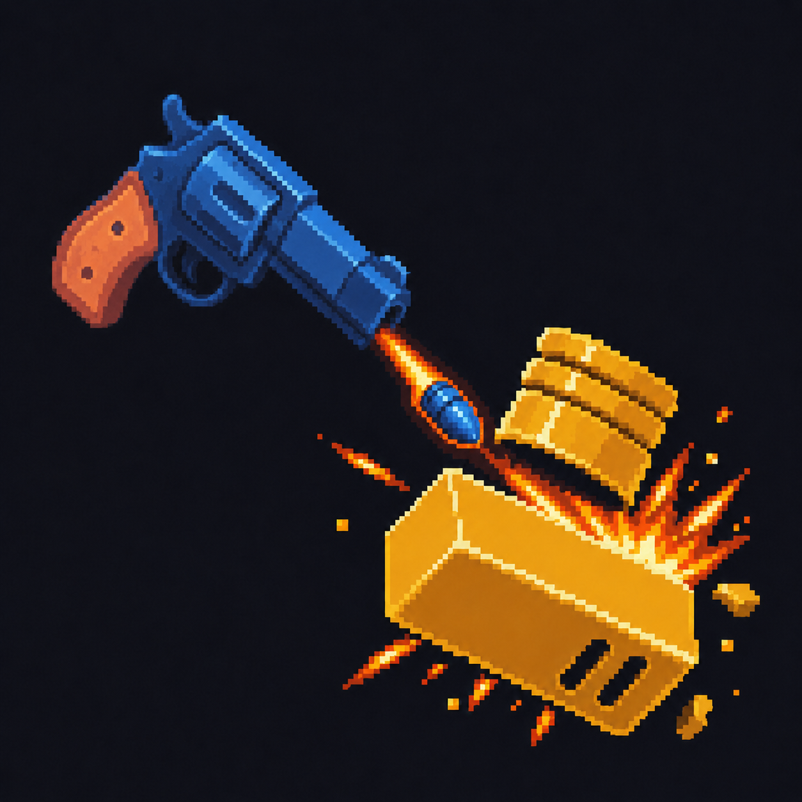
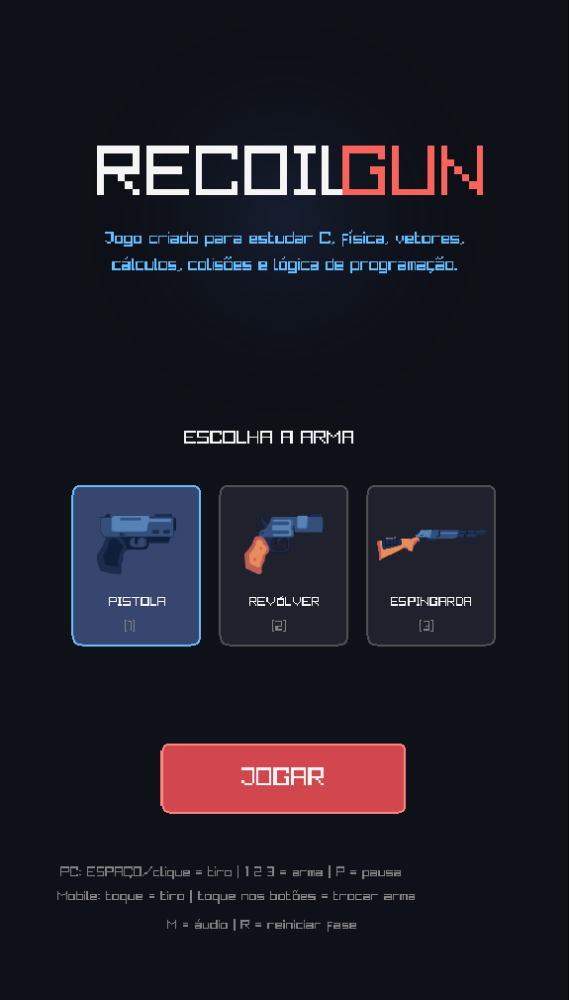
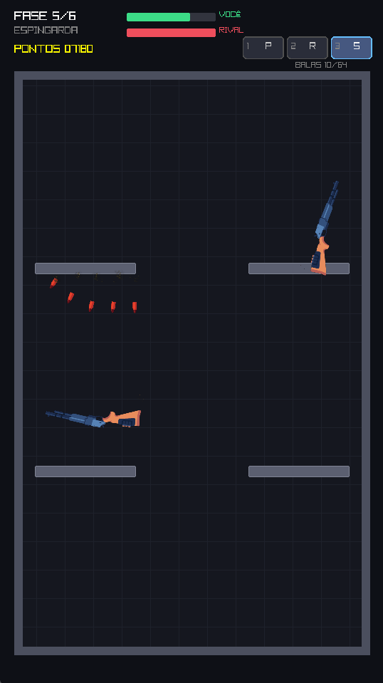
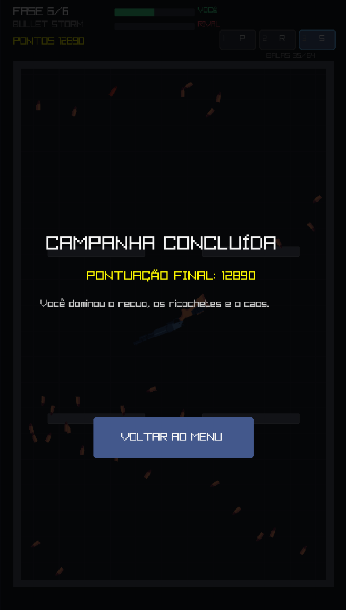
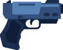
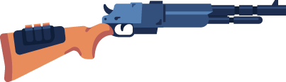

<a id="readme-top"></a>

<div align="center">

  <a href="https://raw.githubusercontent.com/auhauhbr/recoil-gun-jogo/main/docs/gameplay.mp4" title="Assistir ao gameplay">
    
  </a>

  <h1>Recoil Gun</h1>

  <p>
    Jogo 2D de duelo e física desenvolvido em C, no qual cada disparo também movimenta a arma pelo recuo.
    O projeto foi criado como estudo prático de programação, vetores, trigonometria, colisões, corpos rígidos e lógica de jogos.
  </p>

  <p>
    
    
    
    
    
    
  </p>

  <p>
    <a href="https://raw.githubusercontent.com/auhauhbr/recoil-gun-jogo/main/docs/gameplay.mp4">
      
    </a>
  </p>

</div>

## Sobre o projeto

**Recoil Gun** é um jogo vertical de duelo em que a arma funciona ao mesmo tempo como meio de ataque e de movimentação. Cada disparo cria um projétil na direção atual do cano e aplica um impulso de recuo ao corpo físico da arma.

O jogador usa esse movimento para permanecer na arena, criar ângulos de tiro, aproveitar ricochetes, ativar power-ups e derrotar o rival. O projeto utiliza uma resolução lógica fixa de **540 × 960 (9:16)**, pensada para formato mobile/portrait, mas desenvolvida e testada principalmente no desktop.

A campanha possui **6 fases**, três armas selecionáveis, IA rival, power-ups, pontuação, áudio, partículas e tela de conclusão. O jogo também inclui um **modo Sobrevivência** com ondas progressivas, dificuldade crescente, combo de acertos e recorde local.

## Gameplay

<table>
  <tr>
    <th width="33%">Seleção de armas</th>
    <th width="33%">Duelo e física</th>
    <th width="33%">Campanha concluída</th>
  </tr>
  <tr>
    <td align="center">
      <a href="./docs/prints/menu.png">
        
      </a>
    </td>
    <td align="center">
      <a href="./docs/prints/fase-5.png">
        
      </a>
    </td>
    <td align="center">
      <a href="./docs/prints/campanha-concluida.png">
        
      </a>
    </td>
  </tr>
</table>


## Modo Sobrevivência

O modo **Sobrevivência** reaproveita o mesmo sistema de física da campanha, mas transforma os duelos em uma sequência contínua de ondas. O objetivo é sobreviver pelo maior tempo possível e superar o recorde salvo localmente.

A progressão funciona assim:

- cada onda concluída aumenta a vida e a agressividade do rival;
- a arma do inimigo alterna entre pistola, revólver e espingarda;
- novos obstáculos aparecem gradualmente na arena;
- power-ups são sorteados a cada onda;
- o jogador recupera **1 ponto de vida** ao vencer uma onda, até o limite inicial;
- acertos consecutivos formam um combo de até **x8**, aumentando a pontuação;
- receber dano ou deixar o tempo do combo expirar reinicia o multiplicador;
- o melhor resultado é salvo em `recorde.dat`, mantido fora do Git pelo `.gitignore`.

No menu principal, pressione `S` ou clique em **SOBREVIVÊNCIA** para iniciar uma tentativa.

## Referência

A mecânica inicial de movimentação por recuo foi inspirada em **Gun Duel**. O Recoil Gun é um projeto próprio de estudo: código, ajustes de física, fases, power-ups e organização foram desenvolvidos especificamente para este projeto.

- **Gun Duel — Google Play:** [play.google.com/store/apps/details?id=com.gdm.gunduel](https://play.google.com/store/apps/details?id=com.gdm.gunduel)
- **Vídeo usado como referência:** [YouTube — KaI_bUIBQKY](https://www.youtube.com/watch?v=KaI_bUIBQKY)

> Recoil Gun é um projeto independente e não possui afiliação com os desenvolvedores de Gun Duel.

## Lógica física

A **raylib** cuida da janela, renderização, sprites, entrada e áudio. O **Box2D 3.x** mantém o mundo físico, os corpos das armas, obstáculos e projéteis.

A direção do cano parte do ângulo atual da arma:

```text
direção = (cos(ângulo), sin(ângulo))

velocidade do projétil = direção × velocidade do tiro
recuo base             = -direção × força de recuo
```

O recuo foi ajustado para priorizar o **game feel**. Além do impulso contrário ao disparo, existe sustentação vertical mínima e recuperação próxima ao chão para impedir que a arma fique presa no piso sem possibilidade de voltar à arena.

Outros pontos importantes da simulação:

- conversão entre pixels e unidades físicas;
- gravidade reduzida para um movimento mais controlável;
- armas como corpos rígidos dinâmicos com rotação;
- ricochetes e restituição nas superfícies;
- projéteis marcados como `isBullet` para detecção contínua de colisão;
- filtros de colisão entre cenário, armas e projéteis;
- tempo de vida e limite de ricochetes por projétil;
- limite global de **64 projéteis**;
- cálculo da posição real do cano para bala, muzzle flash e efeitos acompanharem a rotação da arma.

## Armas

<table>
  <tr>
    <th width="33%">Pistola</th>
    <th width="33%">Revólver</th>
    <th width="33%">Espingarda</th>
  </tr>
  <tr>
    <td align="center">
      <a href="./assets/armas/pistola.png">
        
      </a>
    </td>
    <td align="center">
      <a href="./assets/armas/revolver.png">
        
      </a>
    </td>
    <td align="center">
      <a href="./assets/armas/espingarda.png">
        
      </a>
    </td>
  </tr>
  <tr>
    <td align="center">Equilibrada e previsível</td>
    <td align="center">Maior velocidade e recuo</td>
    <td align="center">Dispersão de múltiplos projéteis</td>
  </tr>
</table>

Cada arma possui configuração própria de velocidade, força do recuo, cooldown, quantidade de projéteis, ricochetes, tempo de vida, tamanho físico e posição do cano.

## Power-ups

| Power-up | Efeito |
|---|---|
| **2X** | Duplica os projéteis ativos |
| **3X** | Cria dois clones para cada projétil ativo, permitindo sequências como `2 → 6 → 18 → 54` |
| **+2R** | Adiciona dois ricochetes aos projéteis ativos |
| **FAST** | Aumenta a velocidade dos projéteis ativos |
| **SKULL** | Combina multiplicação, ricochete adicional e aumento de velocidade |

Os clones preservam o tempo de vida e os ricochetes restantes do projétil original para impedir multiplicações infinitas.

## Tecnologias utilizadas

| Tecnologia | Onde foi utilizada |
|---|---|
| [![C17][c-badge]][c-url] | Game loop, estruturas, arrays, módulos `.c/.h`, estados, matemática e regras do jogo |
| [![raylib][raylib-badge]][raylib-url] | Janela, renderização 2D, sprites, partículas, textos, teclado, mouse, touch e áudio |
| [![Box2D][box2d-badge]][box2d-url] | Corpos rígidos, gravidade, impulsos, rotação, colisões, restituição, filtros e CCD |
| [![CMake][cmake-badge]][cmake-url] | Configuração do build, ligação das bibliotecas e organização da compilação |
| [![GCC][gcc-badge]][gcc-url] | Compilação C17 e warnings durante o desenvolvimento |
| [![Linux][linux-badge]][linux-url] | Ambiente principal de desenvolvimento e testes no CachyOS |

## Assets, sprites e arquivos usados

O repositório mantém somente os recursos efetivamente utilizados pelo jogo.

### Armas e projéteis — 2D Guns

**Autor:** Kay Lousberg  
**Download:** [2D Guns — itch.io](https://kaylousberg.itch.io/gun-assets)  
**Licença:** CC0

| Arquivo do pack | Arquivo usado no projeto |
|---|---|
| `PNG/pistol.png` | [`assets/armas/pistola.png`](./assets/armas/pistola.png) |
| `PNG/revolver.png` | [`assets/armas/revolver.png`](./assets/armas/revolver.png) |
| `PNG/shotgun.png` | [`assets/armas/espingarda.png`](./assets/armas/espingarda.png) |
| `PNG/small_bullet.png` | [`assets/projeteis/bala_pistola.png`](./assets/projeteis/bala_pistola.png) |
| `PNG/medium_bullet.png` | [`assets/projeteis/bala_revolver.png`](./assets/projeteis/bala_revolver.png) |
| `PNG/large_bullet.png` | [`assets/projeteis/bala_espingarda.png`](./assets/projeteis/bala_espingarda.png) |

### Efeitos — Kenney Particle Pack

**Download:** [Kenney Particle Pack](https://kenney.nl/assets/particle-pack)  
**Licença:** CC0

| Arquivo do pack | Arquivo usado | Função |
|---|---|---|
| `muzzle_01.png` | [`assets/efeitos/muzzle.png`](./assets/efeitos/muzzle.png) | Flash na boca da arma |
| `spark_03.png` | [`assets/efeitos/faisca.png`](./assets/efeitos/faisca.png) | Faíscas de impactos e disparos |
| `smoke_01.png` | [`assets/efeitos/fumaca.png`](./assets/efeitos/fumaca.png) | Fumaça e partículas |
| `magic_03.png` | [`assets/efeitos/powerup.png`](./assets/efeitos/powerup.png) | Efeito visual dos power-ups |

### Áudio e música

| Origem / arquivo | Arquivo usado no projeto | Download | Licença |
|---|---|---|---|
| `cz.wav` | [`assets/audio/tiro_pistola.wav`](./assets/audio/tiro_pistola.wav) | [Gunshot Sounds — OpenGameArt](https://opengameart.org/content/gunshot-sounds) | CC BY 3.0 — Vincent Sevedge |
| `mosin.wav` | [`assets/audio/tiro_revolver.wav`](./assets/audio/tiro_revolver.wav) | [Gunshot Sounds — OpenGameArt](https://opengameart.org/content/gunshot-sounds) | CC BY 3.0 — Vincent Sevedge |
| `shotty.wav` | [`assets/audio/tiro_espingarda.wav`](./assets/audio/tiro_espingarda.wav) | [Gunshot Sounds — OpenGameArt](https://opengameart.org/content/gunshot-sounds) | CC BY 3.0 — Vincent Sevedge |
| `30932__aust_paul__bullet-ricochet.wav` | [`assets/audio/ricochete.wav`](./assets/audio/ricochete.wav) | [Freesound — aust_paul](https://freesound.org/people/aust_paul/sounds/30932/) | CC0 |
| `powerUp3.ogg` | [`assets/audio/powerup.ogg`](./assets/audio/powerup.ogg) | [Kenney Digital Audio](https://kenney.nl/assets/digital-audio) | CC0 |
| `impactMetal_medium_000.ogg` | [`assets/audio/impacto.ogg`](./assets/audio/impacto.ogg) | [Kenney Impact Sounds](https://kenney.nl/assets/impact-sounds) | CC0 |
| `click1.ogg` | [`assets/audio/clique.ogg`](./assets/audio/clique.ogg) | [Kenney UI Audio](https://kenney.nl/assets/ui-audio) | CC0 |
| `8bit-spaceshooter.mp3` | [`assets/musica/tema.mp3`](./assets/musica/tema.mp3) | [8-bit Epic Space Shooter Music — OpenGameArt](https://opengameart.org/content/8-bit-epic-space-shooter-music) | CC0 |

As licenças preservadas estão em [`assets/licencas/`](./assets/licencas/). Os créditos e as origens dos recursos utilizados estão documentados nesta própria seção do README.

## Estrutura principal

```text
recoil-gun-jogo/
├── assets/
│   ├── armas/
│   ├── projeteis/
│   ├── efeitos/
│   ├── audio/
│   ├── musica/
│   └── licencas/
├── docs/
│   ├── capa-readme.png
│   ├── gameplay.mp4
│   └── prints/
├── include/
├── scripts/
├── src/
├── CMakeLists.txt
├── LICENSE
└── README.md
```

## Como executar

### CachyOS / Arch Linux

Instale as dependências:

```bash
sudo pacman -S --needed gcc cmake raylib box2d
```

Clone e entre no projeto:

```bash
git clone https://github.com/auhauhbr/recoil-gun-jogo.git
cd recoil-gun-jogo
```

Compile:

```bash
./scripts/compilar.sh
```

Execute:

```bash
./scripts/executar.sh
```

Também é possível compilar diretamente com CMake:

```bash
cmake -S . -B build -DCMAKE_BUILD_TYPE=Debug
cmake --build build
./build/recoil-gun
```

## Controles

| Entrada | Ação |
|---|---|
| `Espaço` | Disparar |
| Clique esquerdo | Disparar |
| Toque | Disparar |
| `1` | Pistola |
| `2` | Revólver |
| `3` | Espingarda |
| `P` | Pausar / continuar |
| `R` | Reiniciar fase / reiniciar tentativa no modo Sobrevivência |
| `M` | Ativar / desativar áudio |
| `Enter` | Confirmar / avançar / iniciar campanha |
| `S` | Iniciar Sobrevivência a partir do menu |
| `Esc` | Fechar o jogo |

## Licença e créditos

O código-fonte está sob a licença **MIT**. Os sprites, efeitos, sons e música seguem as licenças de seus respectivos autores.

Consulte a seção **Assets, sprites e arquivos usados** deste README e os arquivos em [`assets/licencas/`](./assets/licencas/) antes de redistribuir os assets.

## Autor e contato

<div align="center">

  <p><strong>Jefferson Tadeu dos Santos</strong></p>

  <p>
    <a href="https://jeffersontadeu.vercel.app">
      
    </a>
    <a href="https://github.com/auhauhbr">
      
    </a>
    <a href="https://www.linkedin.com/in/jefferson-tadeu-dos-santos-0ab133380">
      
    </a>
  </p>

  <p>
    <a href="mailto:tadeu.santos7148@gmail.com">tadeu.santos7148@gmail.com</a>
  </p>

</div>

<p align="right">(<a href="#readme-top">voltar ao topo</a>)</p>

[c-badge]: https://img.shields.io/badge/C-17-A8B9CC?style=for-the-badge&logo=c&logoColor=111827
[c-url]: https://www.open-std.org/jtc1/sc22/wg14/

[raylib-badge]: https://img.shields.io/badge/raylib-6.0-000000?style=for-the-badge
[raylib-url]: https://www.raylib.com/

[box2d-badge]: https://img.shields.io/badge/Box2D-3.1-4CAF50?style=for-the-badge
[box2d-url]: https://box2d.org/

[cmake-badge]: https://img.shields.io/badge/CMake-4.x-064F8C?style=for-the-badge&logo=cmake&logoColor=white
[cmake-url]: https://cmake.org/

[gcc-badge]: https://img.shields.io/badge/GCC-16-663399?style=for-the-badge&logo=gnu&logoColor=white
[gcc-url]: https://gcc.gnu.org/

[linux-badge]: https://img.shields.io/badge/Linux-CachyOS-FCC624?style=for-the-badge&logo=linux&logoColor=111827
[linux-url]: https://www.kernel.org/
